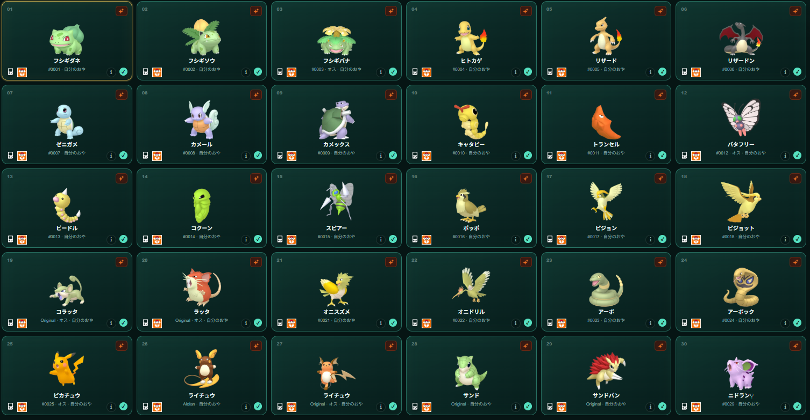

# Home checklist

Home Checklist is a visual tool for planning and tracking a Pokémon HOME collection.

It allows you to organize Pokémon by origin marks, boxes, variants, source, and special collections. It also displays the exact order of each box and saves your collection progress in the browser.

## Build the collection you actually want

Choose a ready-made collection profile or shape the checklist around your own goals. Home Checklist supports Living Dexes, every storable form, regional forms, gender differences, shiny collections, origin marks, event Pokémon, in-game trades, Pokémon GO, Pokéwalker encounters, HOME Challenges, and special collections.

## Find, inspect, and plan

- Browse the complete collection as HOME-style boxes or as a searchable Global view.
- Filter missing Pokémon, favorites, availability, Pokéwalker encounters, and HOME Challenges.
- Sort and group Global results by HOME order, Pokédex number, generation, origin mark, or collection.
- Open any result directly in its exact box and slot, then return to the same result list.
- Review how each entry is obtained, whether Pokémon Bank is required, and why it belongs in the checklist.
- Rename planned boxes, create custom boxes, choose box artwork, and keep personal goals and notes.
- Share links to a search, a filtered Global view, or a specific box and slot without sharing collection progress.
- Import collection records and Austin John’s normal HOME Organizer, or create a portable backup whenever you want.

## One interface, three future releases

The current release is a static Vite web app. Its startup, persistence, and file export now go through a small platform boundary, so a future Tauri 2 shell can reuse the same catalog logic, React views, translations, and responsive UI for Windows and Android instead of creating separate copies.

- `npm run release:web` builds the current GitHub Pages release.
- A future Windows target can package the same `dist/` as an installer `.exe`.
- A future Android target can package it as an `.apk`.

The implementation plan and platform boundary are documented in [`docs/release-architecture.md`](docs/release-architecture.md). Tauri and Rust dependencies are intentionally not installed until native releases are actually scheduled.

## Preview

##

GO reserves numbers 1–1025 even when transfer is currently unavailable.

## IMPORTANT NOTICE

It is highly recommended to use the backup option at the bottom left, as the application is fully static and does not use a server, accounts, or a database. Progress is stored in the browser's `localStorage`; the **Export** and **Import** buttons create and restore JSON backups.
