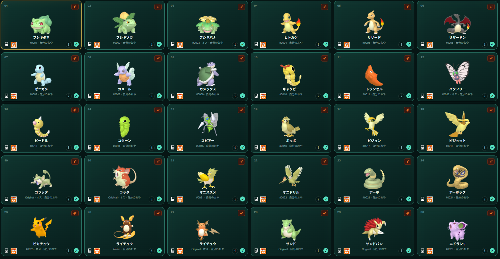

# Home checklist

Home Checklist is a visual tool for planning and tracking a Pokémon HOME collection.

It allows you to organize Pokémon by origin marks, boxes, variants, source, and special collections. It also displays the exact order of each box and saves your collection progress in the browser.

## Build the collection you actually want

Start with a ready-made profile or customize the checklist around your own goals. You can build a basic Living Dex, collect only final evolutions, add regional or every storable form, create the shiny versions of those collections, organize Pokémon by origin mark or original generation, build a male-and-female "Noah's Ark," or go all the way with the Completionist profile.

You can also include gender differences, Alpha Pokémon, Gigantamax Factor, event Pokémon, in-game trades, Pokémon GO, Pokéwalker encounters, HOME Challenges, and special collections such as N's Pokémon, Shadow Pokémon, Dream World, Dream Radar, Mightiest Mark raids, Titan Pokémon, and Battle Bond Greninja.

## Find, inspect, and plan

- Browse your collection as HOME-style boxes, search everything in Global view, or open Summary for a clear progress overview.
- See what you have and what you are missing by generation, origin, availability, and Pokémon HOME Challenge progress.
- Use the Game Planner to see which games can help with your current missing Pokémon and open a focused list for that game.
- Filter by missing Pokémon, targets, availability, origin, special collections, Pokéwalker encounters, HOME Challenges, forms, Alpha Pokémon, and Gigantamax Factor.
- Search, sort, and group Global results, then jump straight to the exact box and slot for any Pokémon.
- Open a Pokémon to see what exact specimen you need, how to obtain it, how to transfer it to HOME, and whether Pokémon Bank is required.
- Save box space automatically or combine compatible planned boxes yourself. You can also rename boxes, create custom boxes, choose box artwork, and keep personal goals and notes.
- Share a search, filtered Global view, or specific box and slot without sharing your collection progress.
- Import collection records or Austin John’s normal HOME Organizer, export your progress, and create portable backups whenever you want.

## Preview

##

GO reserves numbers 1–1025 even when transfer is currently unavailable.

## IMPORTANT NOTICE

It is highly recommended to use the backup option at the bottom left, as the application does not use a server or accounts. The web release stores progress in `localStorage`; native releases use Tauri's application store. The **Export** and **Import** tools create and restore portable JSON backups.
